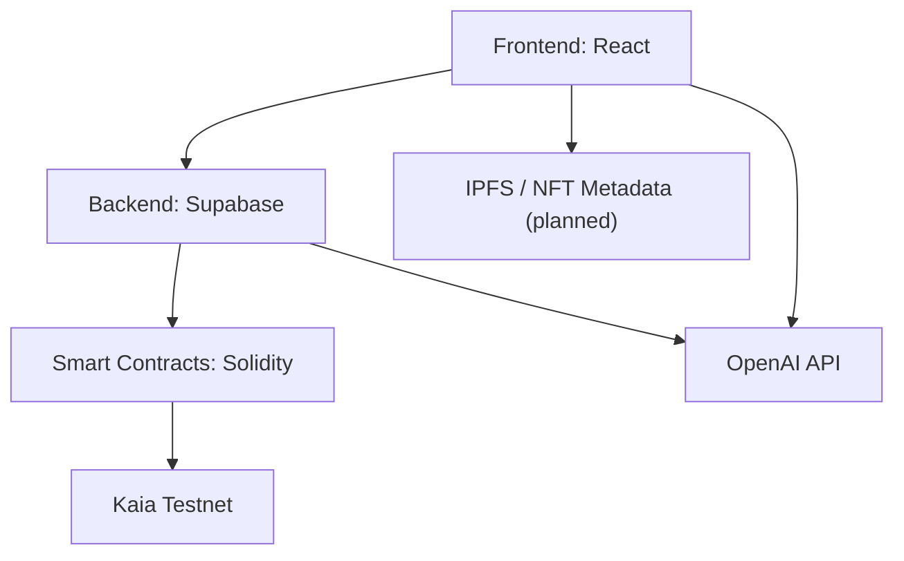

# 🎓 Wiza – Web3 Education Platform

Wiza is a decentralized platform that transforms education by combining on-chain credentials, borderless payments, and AI-powered learning. Built on the Kaia blockchain, it empowers learners and educators to earn, teach, and verify knowledge transparently across the Web3 ecosystem.


## 🔗 Live Deployment

- **Testnet dApp:** [https://wiza-kaia.netlify.app](https://wiza-kaia.netlify.app)
- **Demo:** [Watch on YouTube](https://wiza-kaia.netlify.app/demo)
- **Pitch Deck:** [View](https://wiza-kaia.netlify.app/pitch-deck)
- **Technical Slides:** [View](https://wiza-kaia.netlify.app/docs)

---

## 🚀 Features

- **Verifiable Learning** with KIP-17 (ERC-721) credentials
- **AI Assistant** for guided learning and quiz generation
- **Creator Economy**: Monetize courses, earn KAIA tokens, track wallet earnings
- **Gamified XP System**: XP leaderboard, Cert-to-Earn, Learn-to-Earn incentives
- **Modular Architecture** with Wallet factory, cert minting, and dynamic learning paths

---

## 🧠 Tech Stack

| Layer         | Tech                                               |
|---------------|----------------------------------------------------|
| Frontend      | React, TypeScript, TailwindCSS                     |
| Backend       | Supabase (Postgres, RLS, Storage)            |
| Smart Contracts | Solidity, Kaia Testnet, KIP-17 (ERC-721) NFTs |
| AI Assistant  | GPT-4o via OpenAI API                              |
| Wallet        | Wagmi + Viem / WalletConnect               |

---

## 🛠️ Smart Contracts

### `Wiza.sol`
- **Address**: `0xa6837aFd9705117ED4327CBAd59D7ACE7cB071D3` (Kaia Testnet)
- Deploys user wallets
- Mints KIP-17 (ERC-721) based NFT certificates
- Manages URI mapping for certificates

### `Wallet.sol`
- Holds KAIA tokens for each user
- Tracks deposits, withdrawals, and total earnings
- Only Wiza factory can fund wallets

Contracts are deployed on Kaia Testnet and can be verified on [Kaia Explorer](https://kairos.kaiascope.com).

---

## 📐 System Architecture



## Getting Started (Development)

```
git clone https://github.com/devarogundade/wiza.git
```

```
cd wiza
```

```
npm install
```

```
npm run dev
```


5-d&iZ$b3Nb9%&Y